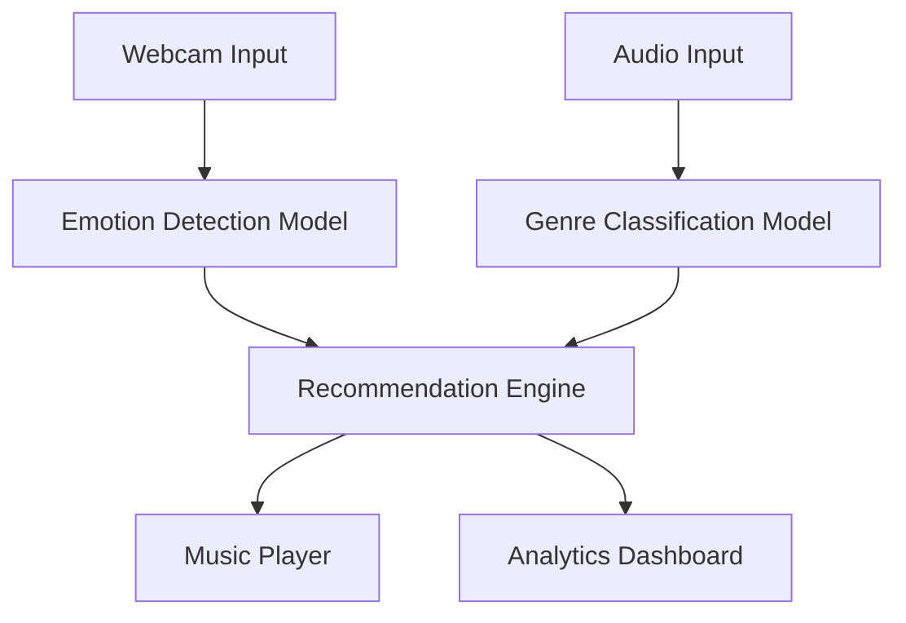

# MoodMix: Emotion-Aware Music Recommendation System 🎵 😊


MoodMix is a cutting-edge music recommendation system that combines real-time emotion detection with advanced genre classification to create the perfect soundtrack for your mood. Using computer vision and deep learning, it analyzes your facial expressions while continuously learning from your music preferences to deliver personalized recommendations.

## 🌟 Key Features

- **Real-time Emotion Detection**: Captures and analyzes facial expressions through your webcam
- **Genre Classification**: Advanced CNN model identifying 10 different music genres
- **Mood-Based Recommendations**: Smart matching algorithm combining emotional state with music characteristics
- **Dynamic Learning**: Adapts to your preferences over time
- **Interactive Visualizations**: Real-time displays of emotion tracking and music analysis
- **Cross-Genre Blending**: Smooth transitions between different genres based on mood shifts

## 🔧 Architecture



## 🚀 Getting Started

### Prerequisites
- Python 3.8+
- Webcam
- NVIDIA GPU (recommended for optimal performance)

### Installation

1. Clone the repository:
```bash
git clone https://github.com/yourusername/moodmix.git
cd moodmix
```

2. Create and activate virtual environment:
```bash
python -m venv venv
source venv/bin/activate  # Linux/Mac
# or
.\venv\Scripts\activate  # Windows
```

3. Install dependencies:
```bash
pip install -r requirements.txt
```

4. Download pre-trained models:
```bash
python scripts/download_models.py
```

5. Run the application:
```bash
python run.py
```

## 📊 Model Performance

| Model Component | Accuracy | Latency |
|----------------|----------|---------|
| Emotion Detection | 89% | ~50ms |
| Genre Classification | 85% | ~100ms |
| Combined Pipeline | - | ~200ms |

## 🎯 Use Cases

1. **Personal Music Sessions**
   - Automatic playlist generation based on mood
   - Continuous adaptation to emotional changes

2. **Study/Work Sessions**
   - Focus-optimized music selection
   - Productivity tracking with mood correlation

3. **Workout Sessions**
   - Energy-level matching
   - Tempo progression based on activity

## 🗂️ Project Structure

```
moodmix/
├── models/                 # Neural network architectures
│   ├── emotion_detect/
│   └── genre_classify/
├── data/                  # Dataset management
├── processing/            # Audio & video processing
├── ui/                    # User interface
├── utils/                 # Helper functions
├── tests/                # Unit tests
└── configs/              # Configuration files
```

## 🔍 Technical Details

### Emotion Detection
- MediaPipe for face detection
- Custom CNN architecture for emotion classification
- 7 basic emotion categories
- Real-time processing at 30fps

### Genre Classification
- Mel-spectrogram based feature extraction
- ResNet-based architecture
- 10 genre categories
- Batch processing capability

### Recommendation Engine
- Hybrid filtering approach
- Emotion-genre correlation matrix
- User preference weighting
- Dynamic similarity scoring

## 🤝 Contributing

We welcome contributions! Please follow these steps:

1. Fork the repository
2. Create your feature branch (`git checkout -b feature/AmazingFeature`)
3. Commit your changes (`git commit -m 'Add some AmazingFeature'`)
4. Push to the branch (`git push origin feature/AmazingFeature`)
5. Open a Pull Request

## 📝 Citation

If you use this project in your research, please cite:

```bibtex
@software{moodmix2025,
  author = {Your Name},
  title = {MoodMix: Emotion-Aware Music Recommendation System},
  year = {2025},
  url = {https://github.com/yourusername/moodmix}
}
```

## 📜 License

This project is licensed under the MIT License - see the [LICENSE](LICENSE) file for details.

## 🙏 Acknowledgments

- GTZAN Dataset for music genres
- FER2013 Dataset for emotion recognition
- TensorFlow team for the amazing framework
- MediaPipe team for face detection capabilities

## 📞 Contact

- Author: Your Name
- Email: your.email@example.com
- Project Link: https://github.com/yourusername/moodmix

---
Made with ❤️ by [Your Name]